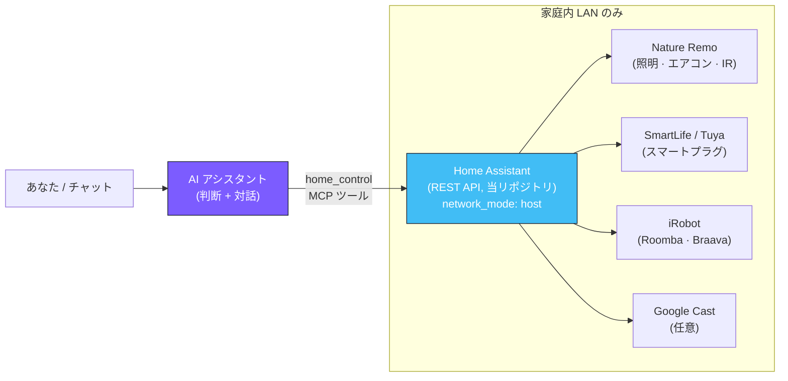

# HomeAssistant

[](LICENSE)
[](https://www.home-assistant.io/)
[](https://docs.docker.com/compose/)

[English](README.md) · **日本語**

> **Linux マシンを「AI アシスタントが叩ける 1 つの家電 API」に変える Docker Compose 構成。**
> [Home Assistant](https://www.home-assistant.io/) を自宅サーバーに立て、照明・エアコン・スマートプラグ・ロボット掃除機を 1 つのローカル API に束ね、その API を AI アシスタント（ベル、OpenClaw プロジェクトの一部）に MCP ツール 1 本で公開します。

## 何をするか

このリポジトリは家庭内オートメーション構成の **デバイス統合レイヤー** です。Home Assistant が
各ベンダー（Nature Remo・SmartLife/Tuya・iRobot・Google Cast …）を 1 つの REST API に束ね、
別の AI アシスタントがその API を叩いて実際に家電を操作します。

役割分担は意図的に分けています:

- **当プロジェクト** = *手*。Home Assistant は「叩いたら家電が動く」だけを公開する。
- **AI アシスタント** = *頭脳*。状況判断と自然言語対話はすべてこちらに集約する。Home Assistant 側の
  自動化機能には判断ロジック・条件分岐を載せない。

汎用ライブラリではなく **参照テンプレート** です。面白いのは
AI アシスタント → MCP ツール → Home Assistant → 実機デバイス という流れと、素直な push-to-deploy
モデルそのものです。



## クイックスタート

SSH で到達できる Linux サーバー（Docker Engine と `docker compose` プラグイン導入済み）が必要です。

```bash
# サーバー側: 作業ディレクトリに clone
ssh youruser@YOUR_SERVER_IP
git clone https://github.com/kitepon-rgb/HomeAssistant.git ~/homeassistant
exit

# ワークステーション側: デプロイ先を設定して push
cp .env.example .env          # HA_SERVER / HA_REMOTE_DIR を自分のホスト向けに編集
bash deploy/deploy.sh         # ssh で入り、git pull → docker compose pull && up -d
```

その後ブラウザで `http://YOUR_SERVER_IP:8123` を開き、Home Assistant の初期セットアップ
（Owner 作成）を行います。Home Assistant は `8123` ポートで待ち受けます。

> Home Assistant は `network_mode: host` で動きます。Nature Remo の mDNS、Tuya の UDP
> ブロードキャスト、SSDP、Google Cast などのローカル探索がコンテナに届くようにするためです。
> **家庭内 LAN 限定** で運用し、リバースプロキシ配下に置いたり外部公開したりしないでください。

## 統合を追加する

初期セットアップ後、Home Assistant の UI から統合を追加します
（**Settings → Devices & Services → Add Integration**）:

| 統合 | 必要なもの |
|---|---|
| Nature Remo | `home.nature.global` で発行する公式トークン |
| Tuya | SmartLife アカウントの OAuth |
| iRobot | 掃除機の BLID / パスワード |
| Google Cast | 自動検出（失敗時は手動 IP 指定で追加） |

## AI アシスタントと連携する

1. Home Assistant の UI で **Profile → Long-Lived Access Tokens** からトークンを発行する。
2. AI アシスタント側に `HA_BASE_URL=http://YOUR_SERVER_IP:8123` と `HA_TOKEN=<発行したトークン>`
   を環境変数として設定し、このサーバーを向けさせる。
3. アシスタントの `home_control` MCP ツールが Home Assistant の REST API を叩くようになる。

## デプロイモデル

編集は GitHub を経由し、サーバーが pull する方式です（家庭内スタック全体で揃えている方式）:

```bash
# ワークステーション側
git add ... && git commit -m "..." && git push
bash deploy/deploy.sh    # サーバーに ssh → git pull → docker compose up -d
```

`deploy/deploy.sh` は `.env` から `HA_SERVER` / `HA_REMOTE_DIR` /（任意）`COMPOSE_CMD` を読み、
SSH 越しに `git pull --ff-only && docker compose pull && docker compose up -d` を実行します。
ランタイム状態（`config/.storage/`・ログ・DB・`.env`・`secrets.yaml`）は git 同期対象外で、
サーバー側に永続化され gitignore されています。

## ディレクトリ構成

```
docker-compose.yml          Home Assistant 本体のコンテナ定義 (network_mode: host)
config/configuration.yaml   最小限の seed 設定 (Git 管理)
config/.storage/, secrets.yaml, ログ   Home Assistant が書き込むランタイム状態 (Git 管理外)
deploy/deploy.sh            SSH 越しに git pull + docker compose up -d
.env / .env.example         デプロイ先ホスト情報 (.env は Git 管理外)
```

## サーバーの注意点

- サーバーは **Ubuntu Server LTS + Docker Engine (rootful)**（apt 公式 `docker-ce`）で、
  `docker compose` プラグインを使います。
- `network_mode: host` は rootful Docker でも動き、mDNS / Tuya UDP / SSDP 探索のために必須です。
- `privileged: true` と `/run/dbus` の bind mount は利用可能ですが未使用です。USB/Bluetooth
  pass-through（例: Wyoming voice satellite）が必要になったときだけ有効化してください。
- Ubuntu の AppArmor 環境では SELinux 固有の `:Z` bind-mount フラグは不要です。
- `restart: unless-stopped` は Docker daemon 起動時（OS 再起動時を含む）にコンテナを自動再起動します。

## 関連プロジェクト

- **OpenClaw** — AI アシスタント本体（ベル）。家電操作の道具 `home_control` MCP ツールを当 Home
  Assistant に対して呼びます。

## ライセンス

MIT — [LICENSE](LICENSE) 参照。
