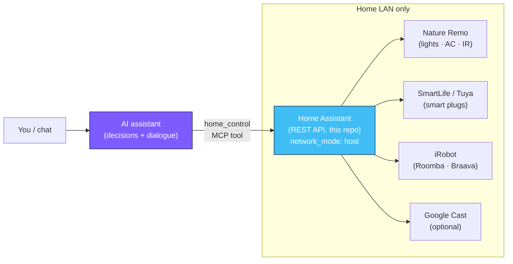

# HomeAssistant

[](LICENSE)
[](https://www.home-assistant.io/)
[](https://docs.docker.com/compose/)

**English** · [日本語](README.ja.md)

> **A Docker Compose scaffold that turns a Linux box into one smart-home API an AI assistant can call.**
> HomeAssistant runs [Home Assistant](https://www.home-assistant.io/) on a home server, unifies lights, air conditioners, smart plugs and robot vacuums behind a single local API, and exposes that API to an AI assistant ("Bell", part of the OpenClaw project) through a single MCP tool.

## What it does

This repo is the **device-integration layer** of a home-automation setup. Home Assistant
bundles every device vendor (Nature Remo, SmartLife/Tuya, iRobot, Google Cast, …) into one
REST API. A separate AI assistant calls that API to actually operate the home.

The split is deliberate:

- **This project** is the *hands*: Home Assistant only exposes "call this and a device moves".
- **The AI assistant** is the *brain*: all decision-making and natural-language dialogue live there. No
  automation logic or conditional branching is placed inside Home Assistant.

It is a **reference template**, not a general-purpose library — the interesting part is the
AI-assistant → MCP tool → Home Assistant → physical-device flow and a clean push-to-deploy model.



## Quick start

You need a Linux server reachable over SSH, with Docker Engine and the `docker compose`
plugin installed.

```bash
# On the server: clone this repo into a working directory
ssh youruser@YOUR_SERVER_IP
git clone https://github.com/kitepon-rgb/HomeAssistant.git ~/homeassistant
exit

# On your workstation: configure the deploy target and push
cp .env.example .env          # edit HA_SERVER / HA_REMOTE_DIR for your host
bash deploy/deploy.sh         # ssh in, git pull, docker compose pull && up -d
```

Then open `http://YOUR_SERVER_IP:8123` and complete the Home Assistant onboarding
(create the owner account). Home Assistant listens on port `8123`.

> Home Assistant runs with `network_mode: host` so local-discovery protocols
> (Nature Remo mDNS, Tuya UDP broadcast, SSDP, Google Cast) reach the container. Keep it on
> the home LAN only — do not put it behind a public reverse proxy or expose it externally.

## Add integrations

After onboarding, add device integrations from the Home Assistant UI
(**Settings → Devices & Services → Add Integration**):

| Integration | What it needs |
|---|---|
| Nature Remo | An official token issued at `home.nature.global` |
| Tuya | Your SmartLife account via OAuth |
| iRobot | The vacuum's BLID / password |
| Google Cast | Auto-discovery (manual IP fallback if discovery fails) |

## Wire up the AI assistant

1. In the Home Assistant UI, go to **Profile → Long-Lived Access Tokens** and issue a token.
2. Point the AI assistant at this server by setting `HA_BASE_URL=http://YOUR_SERVER_IP:8123`
   and `HA_TOKEN=<your token>` in its environment.
3. The assistant's `home_control` MCP tool now drives Home Assistant's REST API.

## Deploy model

Edits flow through GitHub, the server pulls — the same pattern used across the rest of the
home stack:

```bash
# On your workstation
git add ... && git commit -m "..." && git push
bash deploy/deploy.sh    # ssh to the server → git pull → docker compose up -d
```

`deploy/deploy.sh` reads `HA_SERVER`, `HA_REMOTE_DIR` and (optionally) `COMPOSE_CMD` from
`.env`, then runs `git pull --ff-only && docker compose pull && docker compose up -d` over
SSH. Runtime state (`config/.storage/`, logs, the database, `.env`, `secrets.yaml`) is **not**
synced through git — it persists on the server and is gitignored.

## Layout

```
docker-compose.yml          Home Assistant container definition (network_mode: host)
config/configuration.yaml   Minimal seed config (committed)
config/.storage/, secrets.yaml, logs   Runtime state Home Assistant writes (gitignored)
deploy/deploy.sh            git pull + docker compose up -d on the server over SSH
.env / .env.example         Deploy-target host info (.env is gitignored)
```

## Server notes

- The server is **Ubuntu Server LTS + Docker Engine (rootful)** from the official `docker-ce` apt
  packages, with the `docker compose` plugin.
- `network_mode: host` works under rootful Docker and is required for mDNS / Tuya UDP / SSDP discovery.
- `privileged: true` and a `/run/dbus` mount are available but unused — enable them only if you
  later need USB/Bluetooth pass-through (e.g. a Wyoming voice satellite).
- On Ubuntu's AppArmor the SELinux-only `:Z` bind-mount flag is unnecessary.
- `restart: unless-stopped` brings the container back automatically when the Docker daemon starts,
  including across OS reboots.

## Related project

- **OpenClaw** — the AI assistant ("Bell"). It calls this Home Assistant through the
  `home_control` MCP tool to operate the home.

## License

MIT — see [LICENSE](LICENSE).
